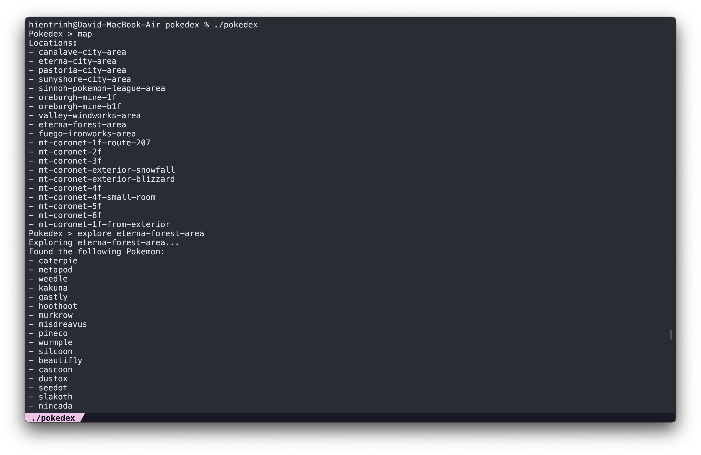
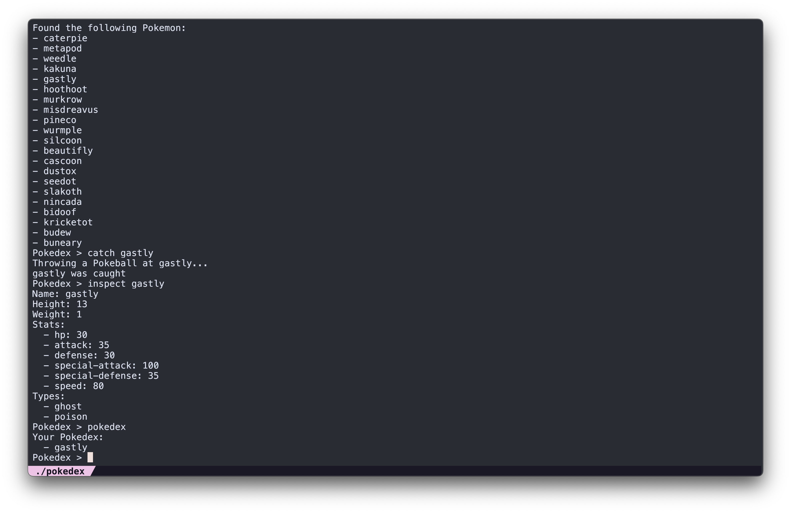

# Pokedex

This project is a CLI game that utilize the PokeAPI to simulate a Pokemon trainer's journey, at the very least the catching and collecting pokemon part.

## Features

-   Move around large areas to search for inhabiting pokemon.
-   Throw a pokeball at any pokemon, whether they succeed or not is based on the base experience of the pokemon plus a little bit of luck.
-   Captured pokemon will be added to the pokedex, such that the trainer can inspect the Pokemon's name, type, basic stats, and abilities.
-   The user can also view a list of all Pokemon in the Pokedex.

## Installation

1. Clone the repository: `git clone https://github.com/Hien-Trinh/pokedex.git`
2. Navigate to the project directory: `cd pokedex`
3. Build and run the project: `go build && ./pokedex`

## Sneak Peek

